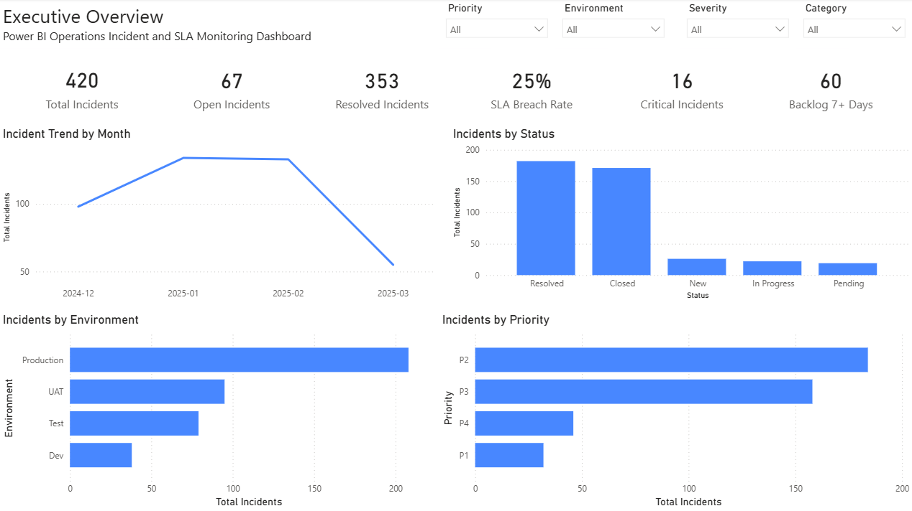
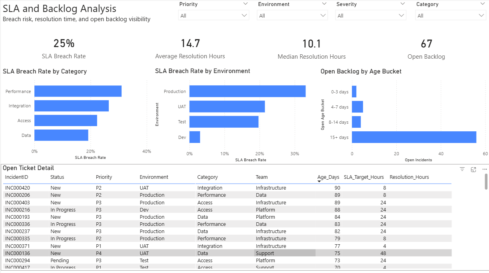

# Power BI Operations Incident and SLA Monitoring Dashboard

**At a glance:** A Data Analyst portfolio project for operations reporting and SLA monitoring. Contains a documented schema, reproducible sample data, DAX measures, and three-page wireframes-so a hiring manager can assess your approach in 30-60 seconds without running the report.

---

## Project Summary

This Power BI project was built as a job-search portfolio piece for Data Analyst roles. It demonstrates how incident and support data can be transformed into a clear executive dashboard for monitoring operational performance, SLA risk, backlog ageing, and issue concentration.

The project is designed to showcase practical analyst capability rather than just visual design. It highlights skills in data preparation, KPI definition, DAX-based reporting logic, dashboard structuring, and stakeholder-focused presentation.

---

## Dashboard Preview



*Executive Overview dashboard showing incident volume, SLA breach rate, critical incidents, backlog pressure, and incident distribution by status, environment, and priority.*



*SLA and Backlog Analysis page showing breach concentration, resolution time, backlog ageing, and open ticket detail for deeper operational diagnosis.*

---

## What This Project Covers

- **Purpose:** A recruiter-friendly Power BI project showing analytical thinking, KPI design, business question framing, and stakeholder-ready reporting.
- **Scope:** One incident-level dataset, one star-style model, and three report pages: Executive Overview, SLA and Backlog Analysis, and Root Cause and Ticket Explorer.
- **Data:** Synthetic sample data (300-500 rows) with realistic patterns. No production or confidential data is used.

**Business questions the dashboard answers:**

1. Where are incidents concentrated?
2. Which categories, environments, or priorities drive SLA breaches and backlog?
3. What should the team prioritise first?

**For recruiters:** [Case study summary, resume bullets, and interview talking points](docs/PORTFOLIO_SUMMARY.md) (Data Analyst roles, Australia-friendly).

---

## What’s Inside

| Deliverable | Location |
|--------------|----------|
| Dataset schema & data dictionary | [docs/dataset_schema.md](docs/dataset_schema.md), [docs/data_dictionary.md](docs/data_dictionary.md) |
| Star schema recommendation | [docs/star_schema.md](docs/star_schema.md) |
| DAX measures (with business questions) | [docs/dax_measures.md](docs/dax_measures.md) |
| Three-page wireframes | [docs/wireframes/](docs/wireframes/) |
| Sample CSV | `data/sample/incidents_sample.csv` |
| Data-generation script | `scripts/generate_sample_data.py` |

---

## Scope & Priorities

Data Analyst **portfolio project**, not an enterprise system. Optimised for: *Can a hiring manager understand my capability in 30–60 seconds?*

| Prioritise | Deprioritise |
|------------|--------------|
| Business clarity, clean data model, strong KPI logic | Advanced AI, unnecessary automation |
| Practical dashboard structure, recruiter readability | Complex scripting, visual gimmicks, unrealistic claims |

Details: [docs/SCOPE_AND_PRIORITIES.md](docs/SCOPE_AND_PRIORITIES.md).

---

## How to Use This Repo

### Build the report in Power BI

1. Open Power BI Desktop.
2. Get data → Text/CSV → select `data/sample/incidents_sample.csv`.
3. Optionally add a date dimension and relate to `CreatedDate` ([Star schema](docs/star_schema.md)).
4. Add measures from [DAX measures](docs/dax_measures.md).
5. Build the three pages from the [wireframes](docs/wireframes/).

### Regenerate the sample data

Requires Python 3. From the repo root:

**Windows (PowerShell):**
```powershell
& .\venv\Scripts\Activate.ps1
python scripts/generate_sample_data.py --rows 420
```

**macOS / Linux:**
```bash
source venv/bin/activate
python scripts/generate_sample_data.py --rows 420
```

Optional: `--rows 400 --seed 123`. Output: `data/sample/incidents_sample.csv` (overwrites existing).

---

## Dashboard Pages

| Page | Purpose |
|------|---------|
| **1. Executive Overview** | This page provides a high-level operational summary. It highlights total incidents, open and resolved incidents, SLA breach rate, critical incidents, backlog over 7 days, and incident distribution across status, environment, and priority. |
| **2. SLA and Backlog Analysis** | This page focuses on operational risk and workload pressure. It shows breach concentration by category and environment, average and median resolution time, backlog volume, backlog ageing, and open ticket detail to support prioritisation. |
| **3. Root Cause and Ticket Explorer** | This page supports deeper exploration of incident drivers. It shows incident distribution by category and team, review-needed case concentration, category-by-environment breakdown, and ticket-level detail for exploration and triage. |

Layouts and visuals: [docs/wireframes/](docs/wireframes/).

---

## Technologies & Assumptions

- **Power BI Desktop** for the report and model.
- **Sample data:** Python stdlib only (`csv`, `random`, `datetime`). Synthetic data for demonstration.
- **Synthetic data:** Created for demonstration and portfolio use only
- **Documentation:** Australian spelling where applicable (e.g. prioritise, organisation).

---

## Licence

Portfolio and learning use. Feel free to adapt the structure, schema, and DAX; no warranty.

---

**GitHub repo setup:** For a short **About** description, suggested **topics**, and a **portfolio-ready checklist** (what’s missing, prioritised by impact and effort), see [docs/GITHUB_AND_READINESS.md](docs/GITHUB_AND_READINESS.md).
